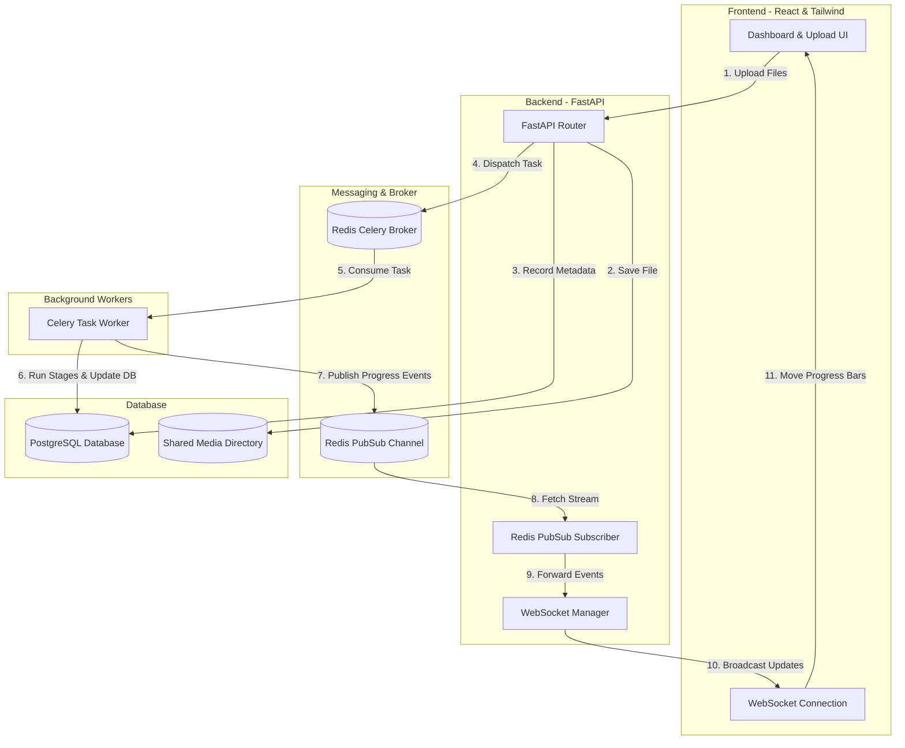

# Async Document Processing Workflow System

A production-grade, asynchronous document processing workflow dashboard. The application utilizes a FastAPI backend, a React + TypeScript frontend, Celery task workers, Redis for broker/pub-sub messaging, and PostgreSQL for structured relational storage. All processes are fully containerized via Docker Compose.

---

## System Architecture



---

## Folder Structure

```
├── backend/
│   ├── app/
│   │   ├── api/
│   │   │   ├── endpoints/          # Route handlers (upload, documents, jobs, export)
│   │   │   ├── deps.py             # Dependency injection providers (get_db)
│   │   │   ├── router.py           # Combined HTTP router
│   │   │   └── ws.py               # WebSocket endpoint & Redis pubsub broadcast task
│   │   ├── core/
│   │   │   ├── celery_app.py       # Celery application initialization
│   │   │   └── config.py           # Pydantic configuration settings
│   │   ├── database/
│   │   │   ├── base.py             # Entity models registry base
│   │   │   └── session.py          # Session engines and DB generators
│   │   ├── models/                 # SQLAlchemy models (Document, Job, ProcessedResult)
│   │   ├── schemas/                # Pydantic validation schemas
│   │   ├── services/               # Business logic core (DocumentService, JobService)
│   │   ├── workers/
│   │   │   └── tasks.py            # Celery task workflow logic (stages simulation)
│   │   └── main.py                 # FastAPI application entry point
│   ├── Dockerfile
│   ├── requirements.txt
│   └── verify_workflow.py          # Workflow integration verification test script
│
├── frontend/
│   ├── src/
│   │   ├── assets/
│   │   ├── components/
│   │   │   └── common/             # Reusable UI tokens (Badge, Navbar, ProgressBar, Toast, Skeleton)
│   │   ├── hooks/
│   │   │   └── useWebSocket.ts     # Reconnection-resilient WebSocket consumer hook
│   │   ├── pages/                  # Route layouts (Dashboard, Upload, Details, Review)
│   │   ├── services/
│   │   │   └── api.ts              # Axios api client service and models
│   │   ├── App.tsx                 # Routing, Layouts & Toast provider wrapper
│   │   ├── index.css               # Tailwind CSS and glassmorphic designs
│   │   └── main.tsx                # App bootstrap entry
│   ├── Dockerfile
│   ├── package.json
│   ├── tailwind.config.js
│   ├── postcss.config.js
│   └── vite.config.ts
│
├── test_data/                      # Prototype test files & JSON/CSV schemas
├── docker-compose.yml              # Services orchestration file
└── README.md                       # Documentation
```

---

## Setup & Running Instructions

### Prerequisites
- [Docker](https://www.docker.com/products/docker-desktop/) installed on your machine.
- [Node.js](https://nodejs.org/) (optional, only if running frontend locally outside of Docker).
- [Python 3.11+](optional, only if running backend locally).

### Running with Docker Compose (Recommended)
This will launch PostgreSQL, Redis, FastAPI, the Celery Worker, and the React frontend in containers.

1. Navigate to the project root directory:
   ```bash
   cd "Async Documnet Processing Workflow System"
   ```
2. Build and spin up all containers:
   ```bash
   docker-compose up --build
   ```
3. Once running, access the services:
   - **Frontend Dashboard:** [http://localhost:5173](http://localhost:5173)
   - **FastAPI API Swagger Docs:** [http://localhost:8001/docs](http://localhost:8001/docs)
   - **FastAPI Core Endpoint:** [http://localhost:8001/](http://localhost:8001/)

### Running Verification Tests (Self-Test)
You can verify the entire workflow (database, Redis, and Celery tasks execution) by running the automated script.

While the Docker environment is running, execute:
```bash
docker-compose exec backend python verify_workflow.py
```
This runs the integration suite synchronously (using Celery `.apply()`) and asserts correct stages processing and database entries.

---

## API Documentation

### HTTP Endpoints

| Method | Endpoint | Description |
| :--- | :--- | :--- |
| `POST` | `/api/upload` | Upload multiple files (using multipart form). Creates jobs & triggers workers. |
| `GET` | `/api/documents` | Retrieve list of all documents with latest job details and parsed values. |
| `GET` | `/api/documents/{id}` | Retrieve composite details of a single document by UUID. |
| `PUT` | `/api/documents/{id}` | Edit extracted metadata fields (title, category, summary, keywords, parameters). |
| `POST` | `/api/documents/{id}/finalize` | Locks document editing. Status changes to `FINALIZED`. |
| `GET` | `/api/jobs` | Retrieve all background jobs trace backlog. |
| `GET` | `/api/jobs/{id}` | Retrieve details of a specific job by UUID. |
| `POST` | `/api/jobs/{id}/retry` | Spawn and dispatch a new processing job for a failed document. |
| `GET` | `/api/export/json` | Download all finalized documents as a merged JSON list. |
| `GET` | `/api/export/csv` | Download all finalized documents as a formatted CSV spreadsheet. |

### WebSocket Endpoint
- **URL:** `ws://localhost:8001/api/ws/jobs`
- **Protocol:** Broadcasts live state updates in JSON frames whenever a background worker moves stages.
  ```json
  {
    "job_id": "97e6822c-a23e-42c2-8408-724bcde9cb2f",
    "document_id": "403bf650-70f9-4d69-ad6a-8b8bc9ebc973",
    "status": "PROCESSING",
    "current_stage": "PARSING_STARTED",
    "progress": 30,
    "error_message": null
  }
  ```

---

## Background Workflow Simulation

Celery worker runs tasks sequentially using delays to let the user monitor real-time updates. The flow maps to these stages:
1. `JOB_QUEUED` (0% progress)
2. `DOCUMENT_RECEIVED` (15% progress)
3. `PARSING_STARTED` (30% progress)
4. `PARSING_COMPLETED` (50% progress)
5. `FIELD_EXTRACTION_STARTED` (70% progress)
6. `FIELD_EXTRACTION_COMPLETED` (85% progress)
7. `STORE_FINAL_RESULT` (95% progress) -> Writes mock details to PostgreSQL.
8. `JOB_COMPLETED` (100% progress)

### Simulated Parser Failure & Retry Test
- To test the error handling: upload any file that contains the word **"fail"** or **"error"** in its name (e.g. `sample_fail_me.txt` under `test_data/`).
- The Celery worker will fail during the parsing stage, transition status to `FAILED`, record the traceback, and trigger a red error tag.
- The UI will display a red "Retry" button. Clicking this triggers `POST /jobs/{id}/retry`, spawning a fresh job that will run to completion.

---

## Design Rationale

### Assumptions
- **Volume sharing:** Assumes that the worker shares access to the uploaded document files via a Docker host volume `shared_data` mapped to `/app/shared_data`.
- **Extraction simulation:** Since no real OCR is requested, we run deterministic heuristic extractions based on keywords inside filenames (e.g., classifying a file containing "invoice" as "Financial").

### Tradeoffs
- **Single Process WebSocket Broadcaster:** Instead of creating a Redis subscription connection for every active websocket client, the FastAPI server spins up a *single* background event listener on startup. This listener forwards events down to active clients. This minimizes Redis connection counts, but requires coordination if scaling to multiple instances (can be resolved using Redis Adapter or sticky sessions).
- **Manual Table Initialization:** We run `Base.metadata.create_all(bind=engine)` inside `main.py` rather than setting up Alembic migrations. This is clean for scaffolding and rapid developer boots.

### Limitations
- **Local File System Storage:** Uploaded files are written directly to local disk volumes. For scaling to multiple nodes, an S3-compatible cloud storage adapter (like MinIO or AWS S3) is required.

### Future Improvements
1. **JWT Authentication:** Secure endpoints using role-based token scopes (Admin vs Viewer).
2. **Real OCR Pipelines:** Incorporate Apache Tika or Tesseract OCR to parse physical file attachments rather than simulating values.
3. **Task Cancellation:** Support Celery task revoking to kill jobs midway through parsing if cancelled by user.
4. **WebSocket Room Subscriptions:** Let clients subscribe to *specific* document UUIDs rather than receiving a broad system event stream, reducing client bandwidth overhead on busy servers.
